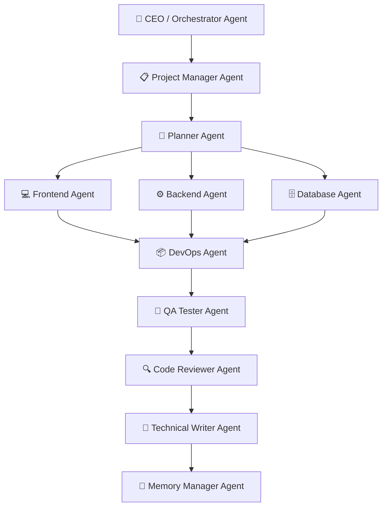

# AI ENGINEERING PLAYBOOK — QUY TRÌNH & NGUYÊN TẮC KỸ THUẬT CHO TẤT CẢ DỰ ÁN

> **NGUỒN QUY TẮC DUY NHẤT (SINGLE SOURCE OF TRUTH) — APPROVED FOR RUNTIME**  
> 🔒 **NGUYÊN TẮC BẤT BIẾN (INVARIANTS FROZEN)**: Playbook này lưu giữ toàn bộ các nguyên lý kỹ thuật, an toàn, quản trị tri thức, và định nghĩa hoàn thành cốt lõi. Mọi hành vi thực thi được chuẩn hóa cho mọi dự án phát triển tại Local, Remote và Production Server.  
> Mọi Sub-Agent và Agent chính BẮT BUỘC tuân thủ nghiêm ngặt 100% bộ quy tắc trong Playbook này.

---

## I. MULTI-AGENT ORCHESTRATION & AGENT LIFECYCLE (BẮT BUỘC)

Mọi Task phải tự động phân chia thành các Sub-Agent chuyên trách theo luồng điều phối nghiêm ngặt:



Nếu dự án có quy mô lớn hoặc yêu cầu đặc thù, AI tự quyết định kích hoạt các Agent chuyên biệt:
- **SEO Agent**: Structured Data, Dynamic Sitemap, Canonical, Performance Core Web Vitals.
- **Security Agent**: RBAC, JWT, Rate Limit, CSP, OWASP Top 10, Secret Scanning.
- **Performance Agent**: Memory Leak, Spatial KNN Indexing, Cache LRU/Redis, Network Payload.
- **GIS Agent**: Spatial Geometry, Spatial Queries, Cluster Density, GPS Navigation.
- **Analytics Agent**: Conversion Funnels, Event Tracking, Data Health Score.
- **PWA Agent**: Service Worker, Offline Shell, Web App Manifest, Install Prompt.

### 1. Agent Reuse Policy (Tái Sử Dụng Agent)
- Nếu Sub-Agent đã tồn tại trong ngữ cảnh và còn phù hợp với nhiệm vụ $\rightarrow$ **Tái sử dụng (Reuse)** thay vì spawn Agent mới.
- Không spawn Agent mới khi Agent cũ vẫn có thể đảm nhiệm.
- **Không hardcode số lượng Agent cố định** (không ép buộc luôn phải có đúng 4 hay N Agent cố định). Số lượng Agent do yêu cầu thực tế của task quyết định.

### 2. Agent Capability Registry (Hồ Sơ Năng Lực Agent)
Mỗi Agent duy trì danh mục năng lực để Scheduler điều phối tối ưu:
- **Skills**: Danh sách kỹ năng chuyên môn đã được đăng ký.
- **Specialization**: Lĩnh vực chuyên sâu (Frontend, Backend, Database, QA, DevOps, Security, Memory).
- **Ownership**: Phạm vi module / repository / domain được phân công phụ trách.

---

## II. PHÂN CÔNG MODEL THEO CHUYÊN MÔN

| Sub-Agent | Model | Nhiệm vụ chính |
|---|---|---|
| 💻 **Frontend Agent** | `inherit` (Gemini) | UI, UX, React, Next.js, Animation, Responsive, Accessibility |
| 🎨 **UI Designer Agent** | `inherit` (Gemini) | Visual Hierarchy, Layout, Spacing, Tokens, Color Palettes |
| 🧠 **Memory Agent** | `inherit` (Gemini) | Cập nhật `memory.md`, `loi.md`, `changelog.md`, `architecture.md` |
| ⚙️ **Backend Agent** | `pro` (Claude Opus/Sonnet) | Business Logic, REST API, Node/Express, Next.js API, Auth |
| 🗄️ **Database Agent** | `pro` (Claude Opus/Sonnet) | Database, Schema Normalization, Indexes, Queries, Migrations |
| 🧪 **QA Agent** | `pro` (Claude Opus/Sonnet) | E2E Testing, Regression, Edge cases, Bug Hunting, Playwright |
| 📦 **DevOps Agent** | `pro` (Claude Opus/Sonnet) | Container, Nginx, Process Manager, Deploy, Rollback, CI/CD, VPS |
| 🛡️ **Security Agent** | `pro` (Claude Opus/Sonnet) | Token security, Injection prevention, Secret protection |
| 🔍 **Code Reviewer** | `pro` (Claude Opus/Sonnet) | Clean Code, DRY, Type Safety, Architecture Review |

---

## III. PLAN REGISTRY & TASK OWNERSHIP

### 1. Plan Registry (Sổ Bộ Kế Hoạch)
Mọi kế hoạch triển khai được cấu trúc phân cấp rõ ràng:
- **Parent Plan**: Mục tiêu tổng thể / Epic / Sprint.
- **Child Plan**: Các subtask cụ thể theo từng tầng kiến trúc.
- **Owner**: Agent hoặc Sub-Agent chịu trách nhiệm chính.
- **Progress**: Tiến độ thực thi định lượng (%).
- **Status**: `NOT_STARTED` | `IN_PROGRESS` | `BLOCKED` | `COMPLETED`.
- **Dependencies**: Điều kiện tiên quyết trước khi bắt đầu subtask.

### 2. Task Ownership (Trách Nhiệm Nhiệm Vụ)
Mỗi Task trong kế hoạch bắt buộc định rõ 4 vai trò:
- **Owner**: Agent thực thi chính (e.g. Backend Agent, Frontend Agent).
- **Reviewer**: Agent rà soát code và kiến trúc (Code Reviewer Agent).
- **QA**: Agent kiểm thử độc lập (QA Tester Agent).
- **Support Agent**: Agent hỗ trợ phối hợp (e.g. Database Agent, DevOps Agent).

### 3. Plan Resume (Khôi Phục Kế Hoạch Khi Khởi Động)
Trong quá trình Startup phiên làm việc, Agent tự động phục hồi:
- **Unfinished Plans**: Kế hoạch đang dang dở từ phiên trước.
- **Blocked Tasks**: Nhiệm vụ đang bị tắc nghẽn và nguyên nhân blocker.
- **Dependencies**: Trạng thái phụ thuộc giữa các task để xác định thứ tự ưu tiên tiếp theo.

---

## IV. QA VERIFICATION, EVIDENCE FIRST & TEST TRACKING (ZERO TRUST)

> **CẤM TUYỆT ĐỐI**: Không Agent nào được phép ghi `PASS`, `DONE`, `VERIFIED` nếu QA Agent chưa chạy kiểm thử thực tế và có bằng chứng xác thực.

### 1. 3-Way Data Parity (Bắt buộc đối soát 3 chiều)
$$\text{Database Query (SQL)} \equiv \text{API Network Payload} \equiv \text{Client DOM Text Content}$$

### 2. Test Count Tracking (Theo Dõi Số Lượng Test Định Lượng)
Khi thêm mới hoặc cập nhật Test Suite, bắt buộc lưu trữ và báo cáo theo định dạng:
$$\text{Previous Count} \rightarrow \text{Current Count } (\Delta)$$
*Ví dụ*: `77 -> 78 (+1)`

### 3. Regression Scope (Phạm Vi Hồi Quy)
Khi thực hiện kiểm thử nghiệm thu, báo cáo bắt buộc chỉ rõ:
- **Affected Tests**: Danh sách các test case chịu ảnh hưởng trực tiếp từ thay đổi.
- **Regression Scope**: Phạm vi các module / luồng nghiệp vụ lân cận cần test hồi quy.
- **Skipped Tests & Skip Reason**: Danh sách test bị bỏ qua (nếu có) kèm lý do kỹ thuật chính đáng.

### 4. Console Clean Gate
- 0 lỗi `TypeError`, `ReferenceError`, 0 `React hydration mismatch`, 0 `unique key warning`.

### 5. Bằng chứng hợp lệ
- Bằng chứng nghiệm thu bắt buộc phải là artifacts thực tế: Screenshots (Mobile + Desktop), JUnit XML, HTML Report, Network payload log, Database count match.

### 6. Production Verification (Xác Minh Môi Trường Production & Bằng Chứng Trực Tiếp) ⭐⭐⭐⭐⭐

> 🚨 **QUY TẮC BẤT DI BẤT DỊCH**:  
> **Never claim that a deployment, build, feature, or production environment is working unless there is direct evidence.**

1. **Evidence includes**:
   - Command output
   - Browser screenshots
   - Playwright results
   - Lighthouse report
   - Logs
   - HTTP responses
2. **If evidence is unavailable, explicitly state**:
   > **"Chưa thể xác minh."**
3. **Instead, provide**:
   - Required verification steps
   - Missing evidence
   - Acceptance criteria
4. ❌ **Do not infer successful deployment from user claims alone.** (Tuyệt đối không suy đoán deploy thành công chỉ dựa trên phỏng đoán hoặc lời nói).

---

## V. UI DESIGN SYSTEM & MOBILE ERGONOMICS

1. **Design System đồng bộ**: Chỉ dùng `shadcn/ui`, `Radix UI`, `Tailwind CSS`, `Lucide SVG Icons`, `Inter font`.
2. **Cấm Emoji trong UI**: Tuyệt đối không dùng emoji (`🚗, 📍, ⭐, 🔥...`) làm icon giao diện sản phẩm. Bắt buộc dùng SVG vector đồng bộ từ bộ icon chuẩn (`lucide-react`, `Heroicons`).
3. **Công thái học Mobile (Visual Hierarchy)**:
   - **Tối đa 1 Primary CTA** trên màn hình tại một thời điểm.
   - Header mỏng gọn ($\approx 110\text{px}$), ưu tiên không gian cho nội dung chính / bản đồ.
   - Route Card gọn nhẹ ($\le 100\text{px}$) có thanh kéo Drag Handle (`──────`), ưu tiên hiển thị **ETA thời gian** trước khoảng cách.
   - Marker đang chọn có hiệu ứng thở / nhịp đập (`markerPulse` animation).
4. **UX chuẩn mực**: Cấm dùng `alert()`, `confirm()`, `prompt()`. Dùng Toast, Dialog/Modal, Drawer/Sheet.

---

## VI. SKILL REGISTRY & KNOWLEDGE LIFECYCLE FRAMEWORK

### 1. Vòng Đời Kỹ Năng (Skill Lifecycle)
```text
Skill Registry ──> Task Matching ──> Reuse Existing Skill ──> Execute ──> Update Skill
```

### 2. Skill Reuse Rule (Quy Tắc Tái Sử Dụng Kỹ Năng)
- Nếu task đã có Skill phù hợp trong Registry $\rightarrow$ **Ưu tiên sử dụng Skill**.
- **Không tự suy luận lại** các workflow đã được chuẩn hóa thành Skill.

### 3. Skill Staleness Audit (Kiểm Tra Độ Lỗi Thời Kỹ Năng)
Skill audit **chỉ chạy khi**:
- Theo lịch định kỳ.
- Khi người dùng yêu cầu trực tiếp.
- Khi có sự dịch chuyển kiến trúc lớn (Major Architecture Drift).
- ❌ **Không audit trong mỗi session thường lệ** để tránh lãng phí tài nguyên.

### 4. Skill Assignment (Phân Công Sở Hữu Kỹ Năng)
Khi phát sinh Skill mới, bắt buộc gán Owner phù hợp:
- `Frontend` | `Backend` | `Database` | `QA` | `DevOps` | `Security` | `Documentation` | `Memory`.

### 5. Knowledge Lifecycle (Vòng Đời Quản Trị Tri Thức)
```text
Discovery ──> Evidence ──> Decision ──> Memory Candidate ──> Consolidation
    ──> RAG Update ──> Skill Candidate ──> Skill Approval ──> Skill Registry
```

### 6. Decision Log (ADR Nhẹ - Architecture Decision Record)
Mọi quyết định kiến trúc quan trọng bắt buộc ghi nhận:
- **Decision**: Nội dung quyết định kỹ thuật.
- **Reason**: Lý do bắt buộc phải chọn phương án này.
- **Alternatives**: Các phương án thay thế đã được cân nhắc và lý do loại bỏ.
- **Impact**: Tác động đến hệ thống, rủi ro và phạm vi ảnh hưởng.

### 7. Reusable Pattern Detection (Nhận Diện Pattern Tái Sử Dụng)
- Nếu một giải pháp / pattern xuất hiện từ **2 lần trở lên** $\rightarrow$ Tự động đề xuất nâng cấp (Promote) thành:
  - **Rule** (Quy tắc bắt buộc)
  - **Skill** (Kỹ năng chuẩn hóa)
  - **Template** (Mẫu kiến trúc / code mẫu)

---

## VII. MEMORY MANAGEMENT & RAG GOVERNANCE

### 1. Cross-Agent Memory Consolidation (Hợp Nhất Bộ Nhớ Đa Agent)
Quy trình chuẩn khi kết thúc phiên:
1. Nếu các Sub-Agent đã được kích hoạt:
   - **Flush MEMORY** của từng Sub-Agent.
   - **Đọc MEMORY** của từng Sub-Agent.
   - **Synthesize cross-agent learnings**: Tổng hợp bài học và phát hiện chéo.
   - **Deduplicate**: Loại bỏ thông tin trùng lặp.
   - **Merge vào Project Memory**: Hợp nhất vào bộ nhớ chung của dự án.
2. ❌ **Không spawn agent mới chỉ để làm bước này** (Agent điều phối chính tự thực hiện).

### 2. Incremental Memory Update (Cập Nhật Bộ Nhớ Tăng Dần)
- Memory phải được cập nhật theo hướng **Incremental (tăng dần)**.
- Chỉ append hoặc update section liên quan trực tiếp đến task.
- ❌ **CẤM rewrite toàn bộ memory**.
- Bảo toàn lịch sử phát triển (History) và các quyết định quan trọng (Decisions).

### 3. Memory Gap Detection (Phát Hiện Khoảng Trống Tri Thức)
Cuối session, tự động rà soát phát hiện:
- Rule mới phát sinh
- Gotcha / bẫy lỗi mới phát hiện
- Architecture Decision Record (ADR) mới
- Reusable Pattern mới
$\rightarrow$ **Thêm Memory Entry mới** (không ghi đè toàn bộ).

### 4. Memory Consolidation Rules (Nguyên Tắc Hợp Nhất Bộ Nhớ)
- **Preserve important knowledge**: Bảo toàn tri thức cốt lõi.
- **Remove duplicated information**: Loại bỏ trùng lặp.
- **Re-organize hierarchy**: Tối ưu hóa phân cấp tiêu đề.
- **Never summarize away critical context**: Tuyệt đối không tóm tắt làm mất ngữ cảnh kỹ thuật quan trọng.
- **Keep retrieval-friendly structure**: Duy trì cấu trúc rõ ràng, thuận tiện cho việc truy vấn (Retrieval).

### 5. Cross-Agent Learning (Học Hỏi Chéo Giữa Các Agent)
Cuối session, tự động merge các nội dung chéo giữa các Agent:
- Discoveries (Phát hiện kỹ thuật mới)
- Patterns (Khuôn mẫu giải pháp)
- Gotchas (Lưu ý và bẫy lỗi)
- Architecture Decisions (Quyết định kiến trúc)

### 6. RAG Re-ranking Policy (Chính Sách Tái Xếp Hạng RAG)
- **Chỉ Re-rank các chunk bị ảnh hưởng** (Re-rank affected chunks only).
- ❌ **Không rebuild toàn bộ RAG** nếu không cần thiết.
- Cập nhật mức độ ưu tiên truy vấn (Retrieval Priority).
- Cập nhật Embedding Metadata của các phần bị ảnh hưởng.

### 7. Memory & RAG Quality Self-Check (Tự Kiểm Tra Chất Lượng)
Trước khi đóng phiên, tự động kiểm tra:
- **Memory Quality**: Duplicate? Outdated? Conflict? Missing links?
- **RAG Quality**: Affected Chunks? Retrieval Priority? Redundancy? Chunk Overlap?

---

## VIII. DATABASE SAFETY & MIGRATION RULE

1. **Cấm tự ý thay đổi Schema**.
2. **Bắt buộc 4 yếu tố trước khi chạy Migration**:
   - **Why**: Lý do kỹ thuật / nghiệp vụ bắt buộc phải thay đổi.
   - **Migration Script**: Câu lệnh SQL / migration an toàn.
   - **Rollback Script**: Câu lệnh hoàn nguyên dữ liệu ngay lập tức nếu lỗi.
   - **Data Risk Assessment**: Đánh giá rủi ro mất mát dữ liệu hoặc downtime.
3. **Bug Process 7 bước**:  
   `Observe` $\rightarrow$ `Hypothesis` $\rightarrow$ `Evidence` $\rightarrow$ `Fix` $\rightarrow$ `Test` $\rightarrow$ `Deploy` $\rightarrow$ `Document (loi.md)`.

---

## IX. MULTI-PROJECT IDENTIFICATION & SOURCE OF TRUTH ⭐⭐⭐⭐⭐

Mỗi khi làm việc, Agent BẮT BUỘC xác định ngữ cảnh dự án và Source of Truth:

```markdown
- **Source of Truth**: [Oracle VPS / Internal VPS / Local Repository]
- **Hành động**:
  - Nếu Oracle VPS → Sửa trên VPS chỉ định. KHÔNG sửa local.
  - Nếu Internal VPS → Sửa trên VPS nội bộ. KHÔNG sửa local.
  - Nếu Local → Làm việc local bình thường.
```

> ⚠️ **QUY TẮC KHÔNG TẠO NHIỀU SOURCE**: Không tạo thêm bản source thứ hai trên local nếu project đã quy định Source of Truth là VPS. Mọi máy đều thao tác trên cùng một source.

---

## X. VPS SAFETY & RESOURCE ISOLATION ⭐⭐⭐⭐⭐

1. **CẤM TUYỆT ĐỐI**:
   - ❌ `pm2 delete all` hoặc `pm2 restart all`.
   - ❌ `rm -rf /` hoặc xóa thư mục không thuộc dự án hiện tại.
   - ❌ `git reset --hard` trên production khi chưa có backup và chưa được người dùng xác nhận.
   - ❌ Khởi động lại toàn bộ VPS (Reboot OS).
2. **Chỉ tác động đúng dịch vụ mục tiêu**:
   - Khởi động lại dịch vụ: `pm2 restart <specific-app-name>`.
   - Kiểm tra RAM/CPU trước và sau khi build để tránh OOM.

---

## XI. PRODUCTION SAFETY & LỆNH NGUY HIỂM ⭐⭐⭐⭐⭐

Mọi thao tác có nguy cơ gây mất dữ liệu hoặc gián đoạn dịch vụ **BẮT BUỘC DỪNG LẠI VÀ XÁC NHẬN VỚI NGƯỜI DÙNG**:
- **Database**: `DROP DATABASE`, `DROP TABLE`, `TRUNCATE`, `DELETE *` không có WHERE, `force-reset`.
- **Hạ tầng**: Thay đổi cấu hình SSL / Certbot, thay đổi DNS.
- **Process & Storage**: Xóa file uploads/documents, sửa file `.env` production.

---

## XII. BACKUP & ROLLBACK POLICY (ZERO DOWNTIME) ⭐⭐⭐⭐⭐

> **Quy tắc vàng**: "Không được deploy lên Production khi chưa chuẩn bị sẵn sàng phương án Rollback."

1. **Backup Scope**: Database, Source Code, Uploads, Environment Variables.
2. **Rollback Trigger**: Kích hoạt ngay khi Build fail, Crash loop, API 500, hoặc QA Verification fail.
3. **Quy trình Rollback**:
   `Checkout last stable commit` $\rightarrow$ `Rebuild` $\rightarrow$ `Restart service` $\rightarrow$ `Restore DB backup nếu cần`.

---

## XIII. CẤU TRÚC TÀI LIỆU BẮT BUỘC CHO MỌI PROJECT

Mỗi repository duy trì bộ tài liệu chuẩn hóa:
- `.antigravity/project.json`: Machine-readable Project Manifest.
- `.antigravity/STATE.md`: Trạng thái runtime và task hiện tại.
- `README.md`: Giới thiệu, cài đặt, chạy dự án.
- `AGENTS.md`: Quy tắc đặc thù cho AI Agent.
- `CHANGELOG.md`: Lịch sử cập nhật chi tiết.
- `DEPLOY.md`: Hướng dẫn triển khai.
- `BACKUP.md`: Hướng dẫn sao lưu & khôi phục.
- `ARCHITECTURE.md`: Kiến trúc hệ thống & data flow.
- `memory.md`: Nhật ký bộ nhớ & quyết định kỹ thuật.
- `loi.md`: Sổ tay ghi nhận lỗi & cách fix.

---

## XIV. DISASTER RECOVERY & INFRASTRUCTURE AS CODE (IaC)

1. **Mô hình 2 tầng**:
   - Tầng 1: Infrastructure Repository (Quản lý OS, Nginx, Caddy, PM2, DB, UFW, scripts khôi phục).
   - Tầng 2: Application Repositories (Mã nguồn từng dự án độc lập).
2. **Quy tắc GitOps IaC**: Không cấu hình thủ công trực tiếp trên VPS nếu chưa cập nhật vào Infrastructure Repository.

---

## XV. GITOPS SESSION WORKFLOW (VÒNG ĐỜI PHIÊN LÀM VIỆC TỰ ĐỘNG)

Mọi phiên làm việc tuân thủ vòng đời 5 giai đoạn:
`Workspace.detect()` $\rightarrow$ `Workspace.open()` $\rightarrow$ `Work & Intercept` $\rightarrow$ `Workspace.verify()` $\rightarrow$ `Workspace.finish()`.

---

## XVI. NGUYÊN TẮC HỘI TỤ TRẠNG THÁI (PRINCIPLE OF STATE CONVERGENCE) ⭐⭐⭐⭐⭐

> **Một phiên làm việc CHỈ ĐƯỢC COI LÀ HOÀN THÀNH khi 3 trạng thái sau ĐỒNG THỜI HỘI TỤ**:
> 1. **Local Workspace**: Working tree sạch sẽ ($0$ uncommitted changes ngoài dự kiến).
> 2. **Remote Git Repository**: Mã nguồn đã được push và remote accepted ($Local \equiv Remote$).
> 3. **Production Infrastructure**: Đã apply thành công lên VPS và vượt qua Health Check ($HTTP \text{ 200 / doctor PASS}$).

---

## XVII. SESSION COMMANDS (LỆNH ĐIỀU KHIỂN PHIÊN ĐẶC BIỆT) ⭐⭐⭐⭐⭐

> 🚨 **QUY TẮC BẮT BUỘC CHO TỪ KHÓA HỆ THỐNG**:
> Hai câu sau đây là **từ khóa hệ thống đặc biệt**:
> - **`Bắt đầu làm việc`** *(hoặc `Bắt đầu phiên`, `Bắt đầu`)*
> - **`Kết thúc phiên`** *(hoặc `Kết thúc làm việc`, `Finish Session`)*
>
> Khi nhận được hai câu này, Agent:
> - ❌ **KHÔNG** được hỏi lại người dùng.
> - ❌ **KHÔNG** yêu cầu xác nhận.
> - ❌ **KHÔNG** lập kế hoạch.
> - ❌ **KHÔNG** đề xuất task hay sprint.
> - ❌ **TRONG MỌI TRƯỜNG HỢP KHÔNG ĐƯỢC KẾT THÚC BẰNG CÂU HỎI**.
> - ❌ Tuyệt đối **CẤM** hỏi: *"Bạn muốn làm gì?"*, *"Bạn muốn tạo project?"*, *"Bạn muốn clone project?"*, *"Tôi có thể giúp gì cho bạn?"*.
> - ✅ **BẮT BUỘC** tự động thực hiện ngay toàn bộ Startup Checklist hoặc Finish Protocol rồi mới dừng lại chờ lệnh tiếp theo.

---

### 1. Lệnh: Bắt đầu phiên / Bắt đầu làm việc

Khi người dùng nhập: **`Bắt đầu phiên`** | **`Bắt đầu làm việc`** | **`Bắt đầu`**

Agent tự động thực hiện toàn bộ **Startup Checklist**:

1. **Ghi nhận Session Time Window**: Lưu `Session Start Timestamp`.
2. **Xác định Repository & Môi Trường**:
   - Đọc tracking remote & branch.
3. **Phân nhánh xử lý Workspace**:
   - **Nếu project ĐÃ TỒN TẠI**:
     - `git pull` (đồng bộ bản mới nhất).
     - Kiểm tra branch và `git status`.
     - Kiểm tra commit local và remote.
     - Đọc `.antigravity/STATE.md` (nếu có).
     - Đọc `README.md` và `AGENTS.md`.
     - Đọc `.antigravity/project.json` (nếu có).
     - Chạy script doctor của dự án nếu tồn tại.
     - **Plan Resume**: Khôi phục `Unfinished Plans`, `Blocked Tasks`, `Dependencies`.
     - Đồng bộ workspace và báo cáo trạng thái ngắn gọn: Branch, Working tree, Commit HEAD, Local = Remote, Task đang làm, Blocker (nếu có).
   - **Nếu WORKSPACE TRỐNG hoặc PROJECT HOÀN TOÀN MỚI**:
     - Tự tạo `README.md` nếu thiếu.
     - Tự tạo `AGENTS.md` nếu thiếu.
     - Tự tạo thư mục `.antigravity/`.
     - Tự tạo `.antigravity/STATE.md`.
     - Tự tạo `.antigravity/project.json`.
     - Nếu chưa có remote $\rightarrow$ Đánh dấu `Source of Truth = UNKNOWN`.
     - Nếu chưa thể xác định project $\rightarrow$ Hoàn tất bootstrap.
     - Commit bootstrap nếu cần.
4. **Kết luận bắt buộc duy nhất (Không kèm câu hỏi)**:
   > **"Hệ thống đã sẵn sàng nhận nhiệm vụ."**

---

### 2. Lệnh: Kết thúc phiên / Finish Session

Khi người dùng nhập: **`Kết thúc phiên`** | **`Kết thúc làm việc`** | **`Finish Session`**

Agent tự động thực hiện toàn bộ **Finish Protocol**:

1. **Ghi nhận Session Time Window**:
   - `Session Start`, `Session End`, `Duration`.
2. **Chạy Project Doctor & Security Scan**:
   - Chạy script test/doctor dự án nếu tồn tại.
   - Rà soát file nhạy cảm (`.env`, `*.db`, cookies, secrets...).
3. **Cross-Agent Memory Consolidation**:
   - Flush và đọc MEMORY của các Sub-Agent (nếu có sub-agent hoạt động).
   - Synthesize cross-agent learnings, deduplicate, merge vào Project Memory (không spawn agent mới).
4. **Memory Gap Detection & Incremental Memory Update**:
   - Rà soát: New Rules, New Gotchas, New ADRs, New Reusable Patterns.
   - Append / update phần tương ứng trong `memory.md`, `loi.md`, `architecture.md`.
   - ❌ Không rewrite toàn bộ memory; bảo toàn history và important decisions.
   - Tự kiểm tra **Memory Quality**: Duplicate? Outdated? Conflict? Missing links?.
5. **RAG Re-ranking & Quality Check**:
   - Re-rank affected chunks only (không rebuild toàn bộ RAG).
   - Cập nhật retrieval priority và embedding metadata cho phần bị ảnh hưởng.
   - Tự kiểm tra **RAG Quality**: Affected Chunks, Retrieval Priority, Redundancy, Chunk Overlap.
6. **Knowledge Changelog**:
   - Ghi nhận: New Rules, Architecture Updates, New Gotchas, Skills, Plans, Memory Entries.
7. **Session Knowledge Summary & Diff**:
   - **Knowledge Summary**: Decisions, Rules, Gotchas, Reusable Patterns, Architecture Updates.
   - **Knowledge Diff**: `[Added]`, `[Updated]`, `[Removed]`, `[Unchanged]`.
8. **Test Tracking & Regression Scope**:
   - Test Count: `Previous Count -> Current Count (Delta)`.
   - Regression Scope: `Affected Tests`, `Regression Scope`, `Skipped Tests & Reason`.
9. **Git State Convergence**:
   - Kiểm tra `git status --porcelain`.
   - Nếu working tree sạch: Không commit, không push.
   - Nếu có thay đổi: `git add` có chọn lọc $\rightarrow$ Conventional commit có scope $\rightarrow$ `git push`.
   - Đối soát mã Hash: `git rev-parse HEAD` $\equiv$ `git ls-remote origin HEAD`.
10. **Xuất Finish Protocol Summary & Session Termination Envelope**:
    ```markdown
    ### 📊 FINISH PROTOCOL SUMMARY
    - **Session Duration**: [Start] → [End] ([Duration])
    - **Knowledge Updated**: [Tóm tắt New Rules, Gotchas, ADRs]
    - **Memory Updated**: [Incremental updates applied, 0 full rewrites]
    - **RAG Updated**: [Affected chunks re-ranked]
    - **Skills Updated**: [Skills registered/updated]
    - **Plans Updated**: [Completed / Blocked / Next Dependencies]
    - **Tests Tracked**: [Previous -> Current (Delta) | Regression Scope]
    - **Git Status**: [Clean / Committed & Pushed]

    ### 📦 SESSION TERMINATION ENVELOPE
    - **Repository**: [Tên repository]
    - **Tracking Remote**: [origin / upstream]
    - **Active Branch**: [main / develop]
    - **Local HEAD Hash**: [Commit Hash]
    - **Remote Ref Hash**: [Remote Hash]
    - **State Convergence**: [✅ CONVERGED / ❌ DIVERGED]
    - **Sync Timestamp**: [YYYY-MM-DD HH:mm:ss UTC+7]
    ```
11. **Gửi thông báo Telegram**:
    ```powershell
    python C:\Users\editor02\.gemini\antigravity\notify_telegram.py "✅ [Antigravity] <Tên Dự Án>: Kết thúc phiên làm việc - Đồng bộ hoàn tất"
    ```
12. **Kết luận bắt buộc duy nhất**:
    > **"Đồng bộ hoàn tất."**
